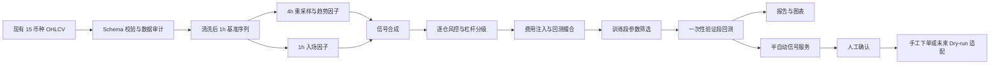
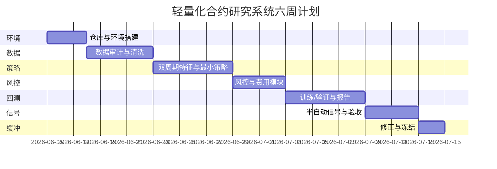
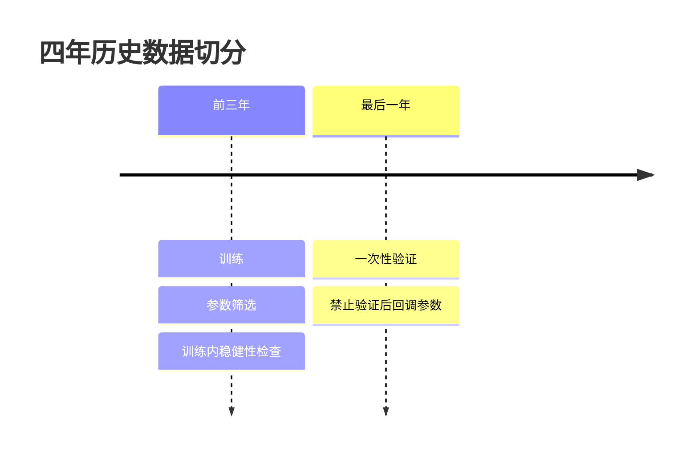
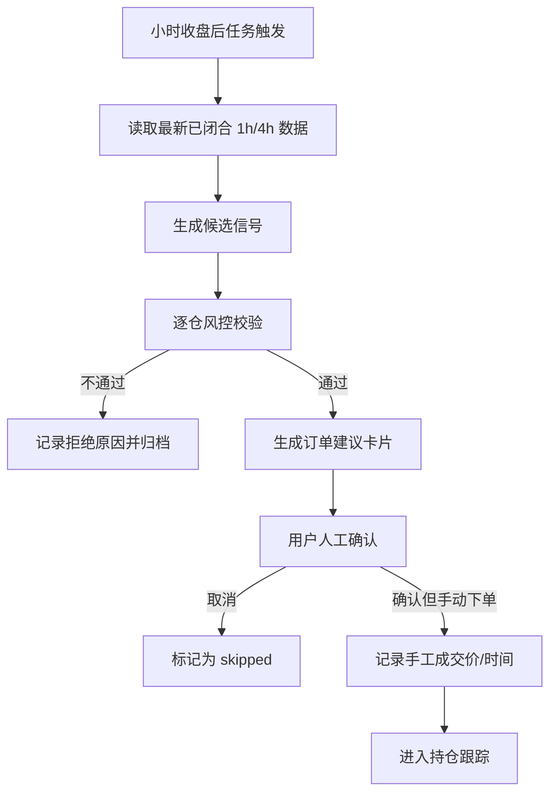

# 轻量化加密货币合约回测与半自动信号系统项目实施规划表

## 执行摘要

这套系统**可以做成**，而且在你给定的边界下，最合理的做法不是“让大模型直接给你下多下空”，而是先做成一套**确定性规则引擎 + 严格回测引擎 + 半自动信号面板**。第一版的目标应当从“预测得很准”改写为“在扣费、滑点、资金费率估算之后，训练段和验证段都表现出可复现的正期望、可解释的止盈止损、并且风控严格不越界”。这是更专业、也更容易验收的目标。回测框架本身也明确提醒：回测不能保证真实市场条件，实盘仍然会遇到滑点和成交偏差，因此第一版必须把“稳定性”和“风险约束”放在“漂亮收益”之前。citeturn12view2turn13view2

从工程选型看，这个项目完全适合做成**单机、轻量化、本地优先**版本。Python 的 `venv` 适合做隔离环境；pandas 原生提供 `resample`、`rolling`、`ewm` 等时间序列能力，NumPy 是数值计算基础；Backtrader 适合作为**主回测引擎**，因为它支持事件驱动订单推进、佣金模型、滑点和基于 bar 成交量的 volume fillers；VectorBT 可以作为**参数扫面加速器**，因为它直接建立在 pandas/NumPy 对象上并支持高性能模拟；Streamlit 适合快速做本地信号面板；Parquet/PyArrow 适合存 OHLCV，SQLite 适合存元数据、信号和交易日志。citeturn18view2turn12view5turn19view1turn15view1turn0search10turn8search2turn12view0turn12view2turn17view0turn17view1turn13view0turn13view1turn13view4turn15view3turn15view4turn13view7turn15view5

如果后面真的要接近实盘，第一版也**不要**让 AI 改写方向、止损、杠杆和仓位。更稳妥的做法是：**规则引擎决定数值，LLM 只负责解释原因**。这样既符合你“不自动实盘、不让 AI 直接决定下单”的硬约束，也能保持系统可审计、可复盘、可回放。尤其是在你只有 OHLCV 的情况下，资金费率和爆仓价格本来就依赖交易所的 mark price、维护保证金梯度和资金费率规则；官方文档也说明，资金费只在持仓跨过资金费结算时点时收取，且不同交易对的结算频率可能不同，甚至会动态缩短，因此第一版必须把这部分建模为**保守估算**，不能假装“精确”。citeturn12view3turn20view0turn20view1

## 规划前提与总体架构

### 项目目标与边界

本项目建议正式定义为：

> 基于你**已有的 15 个币种、4 年历史 OHLCV 数据**，构建一个面向 **1h 入场、4h 判断方向** 的**合约交易研究系统**，覆盖数据质量审计、双周期特征、趋势突破策略、逐仓风控、费用注入、训练/验证回测和半自动信号输出；第一版不做盘口、不接链上、不做高频、不自动实盘下单。

这个目标下，系统的“正确性”首先体现在四件事上：

1. **没有未来函数**。
2. **所有硬约束在代码里被强制执行**。
3. **所有收益指标都以扣费后净值为准**。
4. **验证段只跑一次，不为好看继续改参数**。

### 未指定项与推荐默认值

| 未指定项 | 可选值 | 推荐默认值 | 说明 |
|---|---|---:|---|
| 开发人数 | 1 人 / 2 人 | 1 人 | 你的目标是“一人使用、尽量轻量化”，所以按 1 名量化/后端开发者即可完成 MVP。 |
| 开发周期 | 4 周压缩 / 6 周标准 | 6 周 | 6 周更适合把回测正确性、风控和验收做扎实。 |
| 交易所 | Binance / Bybit / OKX / 抽象适配层 | **先抽象，不绑定** | MVP 不下单，先把回测和信号引擎做对；若以后接实盘，再落地交易所适配器。 |
| 合约类型 | USDT 线性永续 / 反向永续 | **USDT 线性永续** | 线性合约的仓位、PnL、止损和爆仓近似更容易统一。 |
| 手续费假设 | maker / taker 分开；全部按 taker | **全部按 taker** | 为保守起见，回测默认把入场和出场都按 taker 算。Bybit 官方示例中非 VIP taker 为 0.055%、maker 为 0.02%。citeturn20view2 |
| 资金费率估算 | 0.01%/8h；0.03%/8h 压测；0.01%/4h 压测 | **基准 0.01%/8h，压测再加严** | 官方文档说明资金费仅在持仓跨过资金费时点时收付，且部分交易对结算频率会动态调整；因此必须做基准与压力两组回测。citeturn12view3turn7search0turn7search4 |
| 滑点假设 | 2–5 bps 常规；10 bps 压测 | **常规 5 bps，压测 10 bps** | OHLCV 无盘口，滑点只能保守估算。 |
| 数据源格式 | CSV / Parquet | **Parquet 主存，CSV 输入兼容** | pandas 原生支持读写 Parquet；Arrow/Parquet 组合适合存储与分析。citeturn15view3turn15view4turn16view3turn13view7 |
| 部署方式 | 本地脚本 / 本地 Dashboard / Docker | **本地 + 可选 Docker** | Docker 适合把开发、测试和部署环境统一。citeturn16view2 |
| UI 方式 | Streamlit / FastAPI + 前端 | **Streamlit** | 一人使用的本地面板，Streamlit 工程量最低；若以后要 API 再补 FastAPI。citeturn13view4turn13view5 |

### 推荐技术栈

| 层级 | 首选方案 | 备选方案 | 采用原因 |
|---|---|---|---|
| 语言 | Python 3.12 | Python 3.11 | 生态最全，时间序列、回测、可视化、API、信号面板都成熟。 |
| 环境隔离 | `venv` | conda / uv | `venv` 是标准库内置的轻量虚拟环境方案。citeturn18view2 |
| 数值与时序处理 | `pandas` + `numpy` | Polars + NumPy | pandas 直接支持 K 线重采样、窗口、EMA；NumPy 是数值基础。citeturn12view5turn19view1turn15view1turn0search10 |
| 数据校验 | `pandera` | 自写断言 | Pandera 的 `DataFrameSchema` 能对列、索引、类型、空值、重复和自定义检查做结构化校验。citeturn13view3 |
| 指标层 | pandas 原生 + 自定义 ATR | TA-Lib | pandas `ewm` 适合 EMA；TA-Lib 提供 ATR 等指标，但为减少部署摩擦，建议作为可选依赖。citeturn15view1turn15view0 |
| 主回测引擎 | `Backtrader` | Zipline | Backtrader 支持事件驱动、佣金、滑点、成交量填充和 bracket/order 模型，最适合这类 bar 级合约回测。citeturn8search2turn12view0turn12view2turn17view0turn17view1 |
| 参数扫面 | `VectorBT` | 自写并行 Runner | VectorBT 适合大量参数组合的快速研究，基于 pandas/NumPy 对象并有高性能模拟能力。citeturn13view0turn13view1 |
| 研究备用引擎 | Zipline | 无 | Zipline 的优势是 stream-based、可避免 look-ahead bias，但更偏重“框架式研究”，对你的一人轻量 MVP 不如 Backtrader 直接。citeturn13view2turn8search15 |
| 存储 | Parquet + PyArrow；SQLite | 纯 CSV | Parquet 适合长期存储，Arrow 适合内存分析；SQLite 无需单独服务器，适合本地状态和日志。citeturn15view3turn15view4turn16view3turn13view7turn15view5 |
| 可视化 | Plotly + Matplotlib | 纯 Matplotlib | Plotly 适合交互图；Matplotlib 适合批量导出静态图。citeturn18view0turn18view1 |
| 面板与接口 | Streamlit；FastAPI 仅作后续扩展 | Jupyter | Streamlit 能最快搭本地面板；FastAPI 适合后续信号 API 与自动文档。citeturn13view4turn13view5 |
| 日志 | Python `logging` | structlog | 标准库 logging 模块灵活，支持 logger、handler、filter、formatter。citeturn15view2turn17view2 |
| 测试 | `pytest` | unittest | pytest 适合写小而清晰的功能测试，也能扩展到复杂场景。citeturn17view3 |
| 性能优化 | `numba` 可选 | Cython | Numba 能把部分 Python/NumPy 代码编译成机器码，适合热点循环。citeturn17view4 |
| 未来交易所对接 | `ccxt` 仅用于后续 dry-run/只读适配 | 原生 REST SDK | CCXT 提供统一 API 和多交易所支持，但 MVP 不启用自动下单。citeturn14search1turn20view3 |

### 硬约束如何在代码中强制执行

| 硬约束 | 强制执行点 | 技术做法 |
|---|---|---|
| 只用 OHLCV | Data Loader | Schema 只允许 `time, open, high, low, close, volume` 六列；多余列不进入特征计算。 |
| 逐仓，不准全仓 | Risk Engine + Order Model | Position 对象固定 `margin_mode = isolated`；交易适配层不暴露 cross 模式。 |
| 最大杠杆 10 倍 | Pre-trade Validator | `assert leverage_cap <= 10`；任何超出直接拒单。 |
| 杠杆不能为追收益硬抬 | Leverage Policy | 杠杆仅由“波动、止损距离、回撤、亏损连击、验证段表现”决定，不由期望收益决定。 |
| 单币独立本金、独立盈亏 | Ledger | 每个 symbol 独立 ledger；禁止共用 cash pool。 |
| 单币累计亏损 27% 停止开仓 | Halt Policy | `if equity <= init_capital * 0.73: status = halted`。 |
| 每笔必须有 SL / TP / Max Hold | Trade Builder | 信号生成后必须得到三者，否则 trade object 不可创建。 |
| 必须扣手续费/滑点/资金费率 | Cost Engine | 若任一项配置缺失，回测直接中止，不允许用“0”默认跳过。 |
| 第一阶段不自动实盘下单 | Execution Adapter | 默认 `LIVE_ORDER_ENABLED = False`；MVP 不注入私钥，不注册私有下单客户端。 |
| 不稳定直接失败 | Evaluation Gate | 验证段不通过则输出 failed，不进入“继续优化实盘”状态。 |

### 建议架构图



### 建议代码目录

| 目录 | 作用 | 主要产物 |
|---|---|---|
| `config/` | 全局参数、费用假设、风控约束 | `base.yaml`, `risk.yaml`, `fees.yaml` |
| `data/` | 原始、清洗后和特征数据 | `raw/`, `validated/`, `features/` |
| `validation/` | Schema、质量检查、异常审计 | `quality_report.py` |
| `features/` | 1h/4h 特征、EMA、ATR、突破窗口 | `indicators.py` |
| `strategy/` | 方向、入场、出场规则 | `trend_breakout.py` |
| `risk/` | 仓位、杠杆、爆仓检测、27% 停机 | `sizer.py`, `liquidation.py` |
| `backtest/` | 回测 Engine、训练/验证切分 | `runner.py`, `grid_search.py` |
| `reporting/` | 表格、图表、HTML/PDF 报告 | `report_builder.py` |
| `signal_service/` | 每小时任务、信号输出、UI | `job.py`, `app.py` |
| `tests/` | 单元、集成、反未来函数测试 | `test_*.py` |

## 里程碑与时间安排

### 标准版六周里程碑表

| 阶段 | 建议时长 | 具体任务 | 交付物 | 出口标准 |
|---|---:|---|---|---|
| 项目立项与环境搭建 | 3 天 | 建仓库、虚拟环境、配置模板、目录规范、日志规范、测试框架 | `README`、`requirements.lock`、`config` 模板、基础 CI | 一键安装可运行，`pytest` 基础用例通过 |
| 数据审计与清洗 | 5 天 | 读取 15 币种数据、Schema 校验、时区统一、缺失/重复/异常扫描、质量报告 | `data_quality_report.csv/html`、清洗后 Parquet | 每个币种都被明确标记为“保留/淘汰/待人工复核” |
| 双周期特征与最小策略 | 6 天 | 生成 1h/4h 序列、EMA/ATR/突破窗口、过滤器、无未来函数对齐 | `features` 模块、策略规则说明、单测 | 能稳定输出逐 bar 信号，且无未来函数测试通过 |
| 风控、杠杆与费用模块 | 4 天 | 独立本金 ledger、仓位反推、杠杆分级、逐仓爆仓检测、手续费/滑点/资金费率注入 | `risk` 与 `cost` 模块、费用配置 | 每笔交易都能生成 entry/SL/TP/max_hold/leverage/qty |
| 回测、训练/验证与报告 | 6 天 | 训练段 432 组参数网格、筛选、锁定参数、验证段一次性回测、图表报表 | `backtest_result.parquet`、图表、研究报告 | 结果可复现，且 train/valid 报表一致 |
| 半自动信号与验收 | 4 天 | 每小时任务、信号 JSON、Streamlit 面板、人工确认流程、报警/日志 | 本地 Dashboard、信号快照、操作手册 | 人工验收通过；明确“只给建议，不自动下单” |
| 缓冲与修正 | 2 天 | 修 bug、补测试、补文档 | 发布版 tag | MVP 冻结 |

### 压缩版四周安排

如果你只想尽快验证“策略是否值得继续”，可以压缩为四周，但要接受一个现实：**图表、报警、报告美化、监控和未来适配层都会明显缩水**。压缩版应只保留：数据审计、最小策略、风控、回测和本地信号输出。

### 甘特图建议



### 人员与时间估算

| 角色 | 人日估算 | 是否必须 | 说明 |
|---|---:|---|---|
| 量化/后端开发 | 28–32 | 是 | 1 人可覆盖绝大多数任务 |
| 测试/QA | 4–6 | 否 | 一人项目可由开发兼任，但验收质量会下降 |
| 运维/部署 | 1–2 | 否 | 若只做本地版，可忽略；做 Docker/定时任务建议补上 |
| 合计 | 30–35 | — | 标准版 MVP 估算 |

## 数据层实施规范

### 数据输入约束

这一版的**硬前提**是：原始基准数据必须能支持 1h 入场。如果你的原始数据本身就是 1h，那么直接进入清洗流程；如果是 5m/15m/30m，可以先重采样到 1h；如果原始数据粗于 1h，例如 4h 或日线，那么该币种不能用于本项目，因为你不能从更粗周期“反推”出 1h 入场 K 线而不制造假数据。pandas 的 `resample` 明确以 datetime-like index 为前提，适合这类 K 线统一频率转换。citeturn12view5

内部建议统一使用 **UTC** 作为引擎时区，界面再按你的本地时区展示。原因不是“习惯问题”，而是资金费、结算和很多交易所文档都以 UTC 时间组织；Bybit 的资金费说明和 Binance 的资金费结算说明都直接给出 UTC 时点。citeturn12view3turn7search4

### 数据验证与清洗规范

建议把数据校验分为“结构正确性”“时序连续性”“价格逻辑正确性”“成交量有效性”“覆盖一致性”五层。推荐阈值如下表。

| 检查项 | 规则 | 警告阈值 | 失败阈值 | 处理方式 |
|---|---|---:|---:|---|
| 列完整性 | 必须包含 `time, open, high, low, close, volume` | — | 缺任一列即失败 | 直接剔除 |
| 类型合法性 | `time` 可解析；OHLCV 为数值 | — | 任一关键列不可解析 | 直接剔除 |
| 时区合法性 | 可统一为 UTC | — | 无法解析或统一后乱序 | 剔除 |
| 时间排序 | 严格递增 | 可自动排序 | 排序后仍重复/冲突 | 复核或剔除 |
| 原始频率 | 小于等于 1h | — | 大于 1h | 剔除 |
| 重复时间戳 | 完全相同重复可去重 | `<=0.1%` | 冲突重复 `>0` | 冲突即失败 |
| 缺失 K 线比例 | 缺口按期望频率统计 | `0–0.5%` | `>2%` | 介于两者之间人工复核 |
| 最大连续断档 | 连续缺失 1h bars | 2–3 根 | `>3` 根 | 超阈值失败 |
| OHLC 逻辑 | `high >= max(open, close, low)` 且 `low <= min(open, close, high)` | `<=0.01%` 行 | `>0.05%` 行 | 少量删行记 gap；超阈值失败 |
| 价格有效性 | OHLC 全部 `>0` | — | 任意非正值 | 少量删行；多则失败 |
| 零成交量比例 | `volume = 0` | `<=1%` | `>5%` | 超阈值失败 |
| 负成交量 | `volume < 0` | — | `>0` | 失败 |
| 异常收益跳变 | `abs(logret) > 30%` 且 `> 8 * rolling_MAD` 记为异常 | `<=0.1%` 行 | `>0.2%` 行 | 人工复核；无法解释则失败 |
| 时间覆盖一致性 | 与全体公共区间重叠 | `90%–95%` | `<90%` | 组合回测剔除；单币可单独评估 |

### 利用 Pandera 固化数据契约

建议把上述规范固化到 `Pandera DataFrameSchema` 中，而不是分散在 notebooks 里临时断言。Pandera 的 `DataFrameSchema` 能显式定义列、索引、strict、coerce 以及列级检查，这对 15 个币种批量审计尤其重要。citeturn13view3

### 重采样与对齐方法

建议把**1h 作为唯一基准序列**，再从 1h 重采样出 4h。这样能避免多套原始频率混用，降低未来函数风险。pandas `resample` 和 resampling API 支持 `ohlc`、`first`、`last`、`sum` 等聚合方式，适合标准 OHLCV 聚合；`rolling` 和 `ewm` 则适合做突破窗口和 EMA。citeturn12view5turn19view3turn19view1turn15view1

建议使用以下聚合约定：

| 目标周期 | open | high | low | close | volume |
|---|---|---|---|---|---|
| 1h | `first` | `max` | `min` | `last` | `sum` |
| 4h | `first` | `max` | `min` | `last` | `sum` |

缺失的 bar **不做插值，不做前填充价格**。如果某个 4h bar 因 1h 缺失而不完整，就保持 NaN 并把该 bar 标记为不可交易窗口。你在要求里已经明确“不补假数据”，这里必须严格执行。

### 双周期对齐与无未来函数规则

严谨实现建议如下：

1. 先对 4h 收盘序列计算 4h 指标。
2. 再把“**已完成**”的 4h 方向信号对齐到 1h 序列。
3. 1h 入场信号只用当前 bar 收盘时已经能看到的数据。
4. 所有信号都在 **t bar 收盘** 产生，在 **t+1 bar 开盘** 执行。

pandas 的 `shift` 可显式把信号后移一个 bar；`merge_asof(direction='backward')` 则适合把“最近一个已知高周期值”对齐到低周期时间轴。citeturn19view0turn12view6turn9search8

最关键的一条实现规则是：

```text
任何触发条件都只在 bar close 时判定；
任何成交都只在下一根 bar 的可成交价格执行。
```

这不是形式主义，而是回测可信度的底线。Backtrader 文档明确指出，用当前 bar close 成交属于 “cheat on close”，本质上是作弊；若要在开盘成交，应按 next-bar open 的语义处理。citeturn12view0turn12view1

### 每币种数据质量检查表模板

| symbol | 原始频率 | 开始时间 UTC | 结束时间 UTC | 期望 bars | 实际 bars | 缺失比例 | 最大连续断档 | 冲突重复数 | 无效 OHLC 行数 | 零成交量比例 | 异常收益行数 | 覆盖一致性 | 是否可回测 | 备注 |
|---|---|---|---|---:|---:|---:|---:|---:|---:|---:|---:|---:|---|---|
| BTCUSDT | 1h | 2022-06-01 | 2026-05-31 | 35064 | 35040 | 0.07% | 1 | 0 | 0 | 0.00% | 2 | 99.8% | 是 | — |
| ETHUSDT | 1h | … | … | … | … | … | … | … | … | … | … | … | 是/否 | … |

## 策略与风控引擎设计

### 策略实现细节

#### 4h 方向判定

建议实现为：

```text
ema_fast_4h = EMA(close_4h, fast)
ema_slow_4h = EMA(close_4h, slow)
trend_gap = abs(ema_fast_4h - ema_slow_4h) / close_4h
coil = trend_gap < 0.2 * ATR14_4h / close_4h
```

方向规则：

- 当 `ema_fast_4h > ema_slow_4h` 且 `coil = False`，只允许做多。
- 当 `ema_fast_4h < ema_slow_4h` 且 `coil = False`，只允许做空。
- 当 `coil = True`，禁止开仓。

EMA 建议使用 pandas `ewm(..., adjust=False).mean()` 递推形式，这更适合流式计算；pandas 文档明确给出了 `adjust=False` 的递推计算形式。ATR 可以使用 TA-Lib 的 `ATR(high, low, close, 14)`，也可以用自定义 TR + EMA 实现；TA-Lib 官方文档明确提供 ATR，并提醒它存在 warm-up/unstable period，因此开头一段数据必须作为预热窗口丢弃。citeturn15view1turn15view0

#### 1h 入场规则

建议实现为：

```text
breakout_high = rolling_max(high.shift(1), N)
breakout_low  = rolling_min(low.shift(1), N)
atr_pct_1h    = ATR14_1h / close_1h
vol_ratio     = volume_1h / SMA(volume_1h, 20)

long_signal_close  = bias_4h == long  and close_t > breakout_high_t
short_signal_close = bias_4h == short and close_t < breakout_low_t
```

过滤条件：

- `atr_pct_1h` 过低：不开仓。
- `vol_ratio < 0.7`：不开仓。
- 最近 3 根 1h bar 如出现连续极端波动，则进入冷静期，例如接下来 4 根 bar 禁止开新仓。

为了不引入新的大规模调参，建议把这些过滤器做成**固定风控阈值**，而不是纳入网格搜索。网格搜索只保留你已明确规定的 6 组参数：快 EMA、慢 EMA、突破窗口 N、ATR 止损倍数、止盈倍数、最大持仓时间。

#### 入场、出场、止损、止盈、最大持仓时间公式

建议统一使用“**收盘判定，下一 bar 开盘成交**”的事件语义：

```text
entry_price_long  = open_(t+1) * (1 + slippage_in)
entry_price_short = open_(t+1) * (1 - slippage_in)
```

止损与止盈：

```text
atr = ATR14_1h_at_signal
stop_dist = atr_mult * atr

long_stop = entry_price - stop_dist
short_stop = entry_price + stop_dist

long_tp = entry_price + tp_mult * stop_dist
short_tp = entry_price - tp_mult * stop_dist
```

其中：

- `atr_mult ∈ {1.5, 2, 2.5, 3}`
- `tp_mult ∈ {1.5, 2, 3, 4}`
- `max_hold_bars ∈ {24, 48, 72}`

退出优先级建议设计为：

1. **保护性退出先于趋势性退出**：先检查 stop / take-profit 的 intrabar 触发。
2. 若同一根 bar 同时触及 TP 与 SL，由于你只有 OHLCV、没有成交顺序，按**保守价格**处理：多头默认先 hit stop，空头默认先 hit stop。
3. 4h 趋势反转与最大持仓时间属于“bar close 事件”，在下一根 1h 开盘退出。

Backtrader 支持 bracket orders、stop/trailing stops、佣金、滑点和 volume fillers，因此这套语义可以比较自然地落在 event-driven 回测上。citeturn1search2turn1search6turn12view2turn17view0turn17view1

### 风险与杠杆管理模块设计

#### 单币独立 ledger

这是整个系统最重要的风控底座。每个 symbol 都要有独立的：

- `init_capital`
- `cash_available`
- `equity`
- `realized_pnl`
- `unrealized_pnl`
- `max_drawdown`
- `loss_streak`
- `status`

当 `equity <= init_capital * 0.73` 时：

```text
status = halted
allow_new_entry = False
```

这条规则必须在**回测、信号生成、人工确认**三个位置都重复执行，而不是只在回测里做一遍。

#### 仓位计算公式

建议每笔风险预算先固定为该币种当前权益的 `0.5%`，允许上浮到 `1.0%` 但默认不要自动放大。线性合约的基础公式可以写成：

```text
risk_budget = symbol_equity * risk_pct
per_unit_risk = abs(entry_price - stop_price) + entry_price * cost_buffer_rate
qty = floor_to_lot(risk_budget / per_unit_risk)
notional = qty * entry_price
```

其中 `cost_buffer_rate` 至少包括：

- `entry_fee_rate`
- `exit_fee_rate`
- `entry_slippage_rate`
- `exit_slippage_rate`
- `funding_buffer_rate`

然后再反推出需要的初始保证金：

```text
initial_margin = notional / leverage_used
```

若 `initial_margin > cash_available`，则降杠杆、减仓或直接拒绝交易。

#### 杠杆分级逻辑

建议把杠杆做成**质量上限**，而不是先拍脑袋定 10x 再强塞给系统。实现上可做成 deterministic 评分卡：

| 等级 | 杠杆上限 | 建议条件 |
|---|---:|---|
| 高风险 | 1–2x | ATR% 偏高、止损距离偏大、最近连续亏损、该币回撤扩大 |
| 普通 | 3–5x | 波动正常、止损距离居中、趋势清晰但不是最佳形态 |
| 高质量 | 6–8x | 4h 趋势清晰、1h 成交量确认、止损较紧、验证段 PF 与盈亏比达标 |
| 极少数严格场景 | 10x | 仅在高质量条件额外满足“爆仓安全边际充足、近期无连亏、并且验证段不依赖高杠杆收益”时开放 |

建议默认门槛：

- 若 `loss_streak >= 2`，杠杆上限至少下降一档。
- 若该币当前回撤超过 `8%`，杠杆上限至少下降一档。
- 若 `stop_dist_pct > 1.8%` 或 `atr_pct` 位于过去 90 天高分位区间，杠杆上限不得超过 2x。
- 10x 必须额外满足：`liq_distance >= 2 * stop_distance` 且该币最近 30 笔回测交易的验证段条件达标。

#### 爆仓检测与逐仓实现说明

在未指定交易所前，建议采取“**交易所无关的保守近似 + 交易所适配器可替换**”方案。Bybit 官方文档给出了线性 USDT 合约下 isolated mode 的爆仓价近似公式：

```text
Liquidation Price (Long)  = Entry Price - [(Initial Margin - Maintenance Margin)/Position Size]
Liquidation Price (Short) = Entry Price + [(Initial Margin - Maintenance Margin)/Position Size]
```

并说明 isolated margin 下，单个仓位的最大损失受限于该仓位的保证金；同时资金费若从仓位保证金中扣减，会把爆仓价推近 mark price。Binance 官方文档也说明维护保证金取决于 notional 所处的风险梯度。citeturn20view0turn12view4turn12view3turn20view1

因此，MVP 建议这样实现：

```text
position_value = qty * entry_price
IM = position_value / leverage
MM = position_value * mmr_assumed - mm_deduction_assumed
liq_price = exchange_specific_formula_or_conservative_proxy(...)
liq_distance = abs(entry_price - liq_price)
stop_distance = abs(entry_price - stop_price)
```

风控判定：

- 若 `liq_distance <= stop_distance`，交易无效。
- 若 `liq_distance < 1.5 * stop_distance`，标记为“接近爆仓风险”，默认拒绝。
- 若持仓跨资金费时点，需把“资金费最坏方向”再计入保证金 buffer 后重新验算。

另外，Bybit 文档还说明一张订单的 order cost 包括初始保证金、开仓费和估算平仓费；这意味着做保守模拟时，**手续费缓冲本来就是保证金风险的一部分**，不该只算到账后 PnL。citeturn20view2

### 成本模型

建议把成本分成三层：

| 成本层 | 默认处理 | 备注 |
|---|---|---|
| 手续费 | 入场、出场均按 taker 计 | 默认 `0.06%`/side，略高于 Bybit 非 VIP 0.055% |
| 滑点 | 按成交方向加减 bps | 常规 5 bps，压力 10 bps |
| 资金费率 | 只有跨过 funding 时点才计入 | 基准 `0.01%/8h`，压力用 `0.03%/8h` 与 `0.01%/4h` |

Bybit 官方文档明确说明资金费只有在持仓跨过资金费时点时才会收取，且计算形式是 `Funding fee = Position value × Funding rate`；若在该时点之前已平仓，则不收资金费。Binance 和 Bybit 的官方说明也都表明资金费结算频率可能是 8 小时，也可能在特殊情况下调整得更高频。citeturn12view3turn7search4turn7search12

因此，代码层建议这样落地：

```text
entry_fee   = notional_entry * fee_in
exit_fee    = notional_exit  * fee_out
slip_cost   = notional_entry * slip_in + notional_exit * slip_out
funding_fee = sum(position_value_at_funding_time * funding_rate_assumed for each funding event crossed)
net_pnl     = gross_pnl - entry_fee - exit_fee - slip_cost - funding_fee
```

### 成交量约束与只用 OHLCV 的现实处理

Backtrader 文档说明默认 broker 会忽略 volume，但也支持 volume fillers，可按某根 bar 的 volume 百分比来约束成交量。你的数据只有 OHLCV，没有盘口和逐笔，因此**不应该伪造微观成交**；最合理的做法是加入一个简化的 bar 级参与率限制。citeturn17view0

建议添加：

```text
participation_rate = notional / (close * volume)
```

规则示例：

- `participation_rate <= 0.1%`：正常滑点。
- `0.1% < participation_rate <= 0.5%`：滑点上浮 1 档。
- `0.5% < participation_rate <= 1.0%`：滑点上浮 2 档。
- `> 1.0%`：拒绝交易。

这能在不引入 order book 的情况下，显著减少“理论能做、现实不好做”的回测偏差。

### 杠杆风险表模板

| symbol | leverage_band | trades_tested | avg_stop_pct | avg_initial_margin_pct | est_liq_distance_pct | liq_before_stop_count | near_liq_count | max_loss_streak_at_band | funding_events_crossed | rejected_by_risk_gate | 是否通过 |
|---|---|---:|---:|---:|---:|---:|---:|---:|---:|---:|---|
| BTCUSDT | 1–2x | 86 | 0.92% | 48.0% | 3.10% | 0 | 0 | 3 | 7 | 4 | 是 |
| BTCUSDT | 3–5x | 86 | 0.92% | 22.0% | 1.72% | 0 | 2 | 3 | 7 | 11 | 有条件 |
| BTCUSDT | 6–8x | 86 | 0.92% | 13.8% | 1.05% | 3 | 8 | 3 | 7 | 25 | 否 |

## 回测验证与验收标准

### 训练/验证切分与参数网格

你的参数集合固定为：

- 快 EMA：`10, 20, 30`
- 慢 EMA：`50, 60, 80`
- 突破窗口 N：`20, 40, 60`
- ATR 止损倍数：`1.5, 2, 2.5, 3`
- 止盈倍数：`1.5, 2, 3, 4`
- 最大持仓时间：`24, 48, 72`

总共是 `3 × 3 × 3 × 4 × 4 × 3 = 432` 组组合。建议流程是：

1. 前 3 年只用于训练与筛选。
2. 若要在训练期内做稳健性检查，可再做 rolling split，但**仅限训练段内部**；官方的 `TimeSeriesSplit` 就是为时序数据设计的，避免把未来数据用于过去。citeturn12view7
3. 选出 1 套最终参数。
4. 最后 1 年做**一次性验证**。
5. 验证后不回改参数；若失败，直接判定失败，开新研究轮次。

### 反未来函数实现细节

这一块必须单独测试，建议至少覆盖以下 6 条：

| 检查点 | 具体要求 |
|---|---|
| EMA/ATR 输入 | 仅使用截至当前 close 的历史值 |
| 突破窗口 | 用 `high.shift(1)` / `low.shift(1)` 再 rolling，不能把当前 bar 最高/最低塞进自己 |
| 多周期对齐 | 高周期信号只来自已完成的 4h bar |
| 成交时点 | 所有新开仓都在下一根 1h 开盘 |
| 趋势反转退出 | 作为 bar close 事件，在下一根开盘退出 |
| 同 bar TP/SL | 发生顺序未知时按保守价格 |

Zipline 在官方教程里把 stream-based、逐事件处理、避免 look-ahead bias 作为核心优点之一；Backtrader 也明确说明当前 bar close 直接撮合 market order 属于 cheating。你的实现要以这种标准来审查自己。citeturn13view2turn12view0

### 回测执行假设

建议第一版统一采用以下假设，以减少自由度：

| 项 | 建议值 |
|---|---|
| 开仓方式 | next bar open 市价进入 |
| 平仓方式 | stop/TP 为保护性价格；趋势反转/时间到期为 next bar open 退出 |
| 单币并发 | 同一 symbol 同时仅允许 1 个仓位 |
| 多币并发 | 允许，但每币独立本金、独立风控 |
| 仓位模式 | one-way mode |
| 翻向处理 | 先平旧仓，下一 bar 再考虑是否开反向仓 |
| 加仓/摊平 | MVP 禁止 |
| 追踪止损 | MVP 暂不做，避免增加自由度 |

Bybit 文档明确说明 one-way mode 只持有一个方向的仓位，这也很适合你用来简化单币级回测逻辑。citeturn20view2

### 绩效评估指标

建议所有指标都至少输出**训练段、验证段、组合维度**三套。同一份报告里至少要包含：

- 总收益
- 年化收益
- 最大回撤
- 胜率
- 盈亏比
- Profit Factor
- 交易次数
- 平均持仓时间
- 最大连续亏损
- 触发 27% 停机线的币种
- 不同杠杆下的爆仓或接近爆仓风险

推荐再按以下图表输出：

| 图表 | 作用 | 推荐工具 |
|---|---|---|
| 资金曲线 | 看总体收益路径 | Plotly |
| 回撤曲线 | 看最痛苦阶段 | Plotly / Matplotlib |
| 单币种收益柱状图 | 看是否“只靠少数币撑起来” | Plotly |
| 单币种最大回撤图 | 看风险分布 | Plotly |
| 参数热力图 | 看是否对某个参数极端敏感 | Plotly |
| 杠杆风险热力图 | 看高杠杆是否显著放大脆弱性 | Plotly |
| 持仓时间分布 | 看策略是不是拖太久 | Matplotlib |
| 多空分解 | 看只在一个方向有效还是双边都有效 | Plotly |

Plotly 适合交互式图表，Matplotlib 适合生成批量静态报表。citeturn18view0turn18view1

### 回测结果输出表模板

| symbol | train_return | valid_return | train_cagr | valid_cagr | train_max_dd | valid_max_dd | train_win_rate | valid_win_rate | train_payoff | valid_payoff | train_pf | valid_pf | train_trades | valid_trades | avg_hold_hours | max_loss_streak | hit_27pct_stop | leverage_dependency_flag | pass_fail |
|---|---:|---:|---:|---:|---:|---:|---:|---:|---:|---:|---:|---:|---:|---:|---:|---:|---|---|---|
| BTCUSDT | 18.2% | 9.8% | 5.8% | 9.8% | 8.2% | 6.1% | 42.1% | 44.3% | 1.68 | 1.74 | 1.31 | 1.28 | 124 | 37 | 17.4 | 5 | 否 | 否 | 通过 |

### 组合回测结果表模板

| portfolio_name | symbols_included | total_return | cagr | max_drawdown | win_rate | payoff_ratio | profit_factor | total_trades | avg_hold_hours | longest_loss_streak | halted_symbols | pnl_share_from_gt5x | valid_pass |
|---|---:|---:|---:|---:|---:|---:|---:|---:|---:|---:|---|---:|---|
| combo_equal_weight | 12 | 27.4% | 8.4% | 10.9% | 43.8% | 1.59 | 1.26 | 841 | 16.8 | 8 | SOL, DOGE | 11.2% | 是 |

### 过拟合防护与失败判定规则

建议把“失败判定”写死在配置里，而不是复盘之后临时解释。推荐默认规则如下：

| 类别 | 失败条件 |
|---|---|
| 基本一致性 | 训练段赚钱、验证段亏钱 |
| 费用后边际 | 验证段 `Profit Factor < 1.05` |
| 盈亏结构 | 验证段 `payoff_ratio < 1.25` |
| 风险过大 | 组合验证段 `max_drawdown > 15%` |
| 样本不足 | 单币验证段交易数 `< 15` 或组合验证段 `< 120` |
| 分布不健康 | 通过币种中，盈利币种占比 `< 60%` |
| 触发停机过多 | 触发 27% 停机线的币种数 `> 20%` |
| 依赖高杠杆 | 来自 `>5x` 杠杆交易的利润占比 `> 25%` |
| 结果不稳 | 最优参数附近一圈参数组合显著恶化，说明对参数极敏感 |

这里的核心不是把系统卡死，而是防止“明明不稳却被包装成有潜力”。

### 训练/验证切分时间线建议



### 测试与验收标准

建议把验收拆成“工程验收”“策略验收”“风控验收”三组。

| 验收项 | 标准 | 推荐工具 |
|---|---|---|
| 环境可复现 | 新机器一键安装后可跑通 | `venv` / Docker |
| 数据可追溯 | 每个币种都有质量报告与清洗日志 | logging + Parquet + SQLite |
| 无未来函数 | 专门测试通过 | pytest |
| 约束执行 | 每笔交易都有 SL/TP/max_hold；逐仓；杠杆≤10；单币 27% 停机有效 | pytest |
| 成本注入 | 手续费/滑点/资金费率都可追溯到配置与交易明细 | pytest + SQLite |
| 结果可重跑 | 同配置多次运行结果 hash 一致 | pytest |
| 信号可操作 | 每个信号都给出 side、entry、SL、TP、持仓时限、杠杆上限、理由 | Streamlit / JSON |
| 不自动下单 | 无默认私钥、无默认下单按钮、无自动执行计划任务 | 手工 UAT |

Python logging 和 pytest 都很适合把这套验收流程固化下来。citeturn15view2turn17view2turn17view3

## 半自动信号系统与迭代路线

### 半自动信号系统接口设计

对你这种“一人使用、1h 节奏”的场景，建议做成**小时级任务 + 本地 Dashboard + 信号快照**。每个整点 K 线收盘后，系统等待 1–2 分钟确认数据落定，再执行：

1. 读取最新已闭合 1h data。
2. 更新 4h 趋势状态。
3. 生成候选交易。
4. 通过风控网关筛掉不合格交易。
5. 输出可执行信号 JSON 与人类可读解释。
6. 在 Streamlit 面板中展示“待确认”卡片。

建议信号对象字段如下：

| 字段 | 含义 |
|---|---|
| `signal_time_utc` | 信号生成时间 |
| `symbol` | 币种 |
| `bias_4h` | 4h 方向 |
| `side` | long / short |
| `entry_ref` | 参考入场价 |
| `entry_exec_assumption` | 回测假设成交价 |
| `stop_loss` | 止损价 |
| `take_profit` | 止盈价 |
| `max_hold_bars` | 最大持仓 1h bars |
| `risk_pct` | 本笔风险占该币权益比例 |
| `qty` | 建议数量 |
| `leverage_cap` | 本笔允许的最大杠杆 |
| `quality_grade` | A / B / C |
| `reason_codes` | 例如 `4H_TREND_LONG`, `1H_BREAKOUT`, `VOL_OK`, `ATR_OK` |
| `reject_reason` | 若被拒绝，写明原因 |
| `valid_until` | 信号有效期 |

### 人工确认流程



这一步不要做成“点击确认就直接下单”。即便以后接交易所 API，也应该先做 **dry-run / order preview**，再让你确认。Bybit 官方支持 market、limit、conditional、TP/SL 等订单类型，而 CCXT 提供多交易所统一 API，非常适合将来补一个“只读行情 + 订单预览”的适配层；但这必须是**后续迭代**，不能进 MVP。citeturn20view2turn14search1turn20view3

### LLM 在这个系统里的正确位置

如果你仍然想把 DeepSeek 或其他 LLM 融进系统，建议只放在**解释层**，而不是决策层。做法是：

- 规则引擎先输出**锁定后的数值**：方向、进场、止损、止盈、杠杆上限、仓位、拒绝原因。
- LLM 只读取这些结果和少量上下文（如 EMA 关系、突破价、ATR%、量能比、回撤状态）。
- LLM 输出的内容只允许是：
  - 自然语言解释
  - 复盘总结
  - 风险提示
  - 报告摘要

它**不允许**改写任何数值字段，也不能删除风险拦截结论。这样做可以兼顾可解释性和系统可控性。

### MVP 范围

| 模块 | 是否进入 MVP | 说明 |
|---|---|---|
| 数据审计与清洗 | 是 | 必须 |
| 1h/4h 双周期特征 | 是 | 必须 |
| 趋势突破最小策略 | 是 | 必须 |
| 逐仓仓位与杠杆分级 | 是 | 必须 |
| 手续费/滑点/资金费率估算 | 是 | 必须 |
| 训练/验证回测 | 是 | 必须 |
| 本地 Streamlit 面板 | 是 | 强烈建议 |
| 自动实盘下单 | 否 | 明确排除 |
| 盘口/链上/高频 | 否 | 明确排除 |
| 多策略组合优化 | 否 | 第二阶段再说 |
| 真实资金费历史接入 | 否 | 选定交易所后再做 |
| 订单预览 / dry-run API | 否 | 可作为 Phase 2 |

### 后续迭代建议

在 MVP 通过之前，不建议做任何“更聪明”的东西。通过之后，迭代顺序建议是：

| 迭代阶段 | 内容 | 触发条件 |
|---|---|---|
| Phase 2 | 纸面交易 / dry-run，记录人工下单偏差 | MVP 验证段通过 |
| Phase 2 | 接入交易所真实 funding history / mark price / maintenance margin tier | 确定交易所后 |
| Phase 2 | 参数敏感性与 regime 分层 | 结果显示并非偶然 |
| Phase 3 | 增加 Prometheus 指标与 Alertmanager 告警 | 想要长期 unattended 跑任务 |
| Phase 3 | FastAPI 信号接口 | 需要多端查看或后续接机器人 |
| Phase 3 | 只读 CCXT 适配、订单预览 | 需要把手工操作再缩短一步 |

Prometheus 是标准的时序监控与告警工具，适合后面把“每小时任务是否成功、最近数据时间戳、信号数量、回测运行时长、系统异常数”做成可观测指标；Alertmanager 可以对告警去重、分组和路由。对于 MVP，它不是必须；对于长期运行，它很有价值。citeturn16view0turn16view1

### 结论性建议

从严谨性、工程量和你当前目标三方面综合看，**最优路径**是：

1. **先做确定性策略研究系统，不做 LLM 决策系统。**
2. **先做本地单机版，不做大平台。**
3. **先验证“扣费后是否稳定赚钱”，再谈实时信号和手工执行。**
4. **先把逐仓、27% 停机、杠杆上限、爆仓检测做硬，再谈提高收益。**

如果按这份规划实施，你要的两件事其实会自然落地：

- **第一件事：系统能给出实时多空方向与原因。**  
  但这个“方向”和“原因”应当来自**规则引擎**，LLM 只负责转述与解释。

- **第二件事：系统能给出最佳止盈止损位置及其原因。**  
  但这个“最佳”不应表述为绝对最优，而应定义为**在当前策略、当前波动、当前风险预算和当前杠杆约束下的最优一致解**。

这才是一套能被开发团队实现、被量化团队验收、也能被你自己长期用下去的方案。